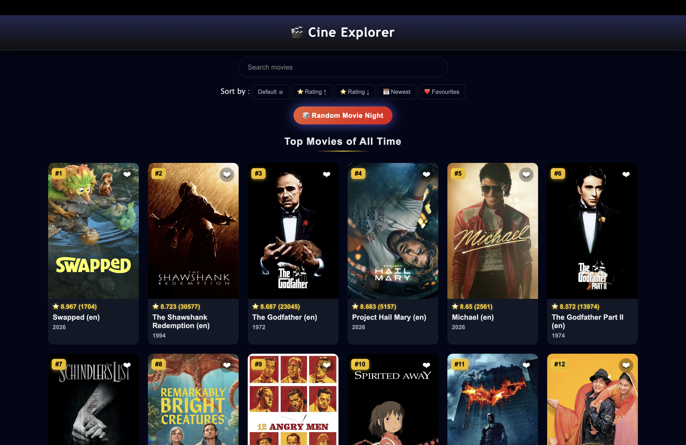
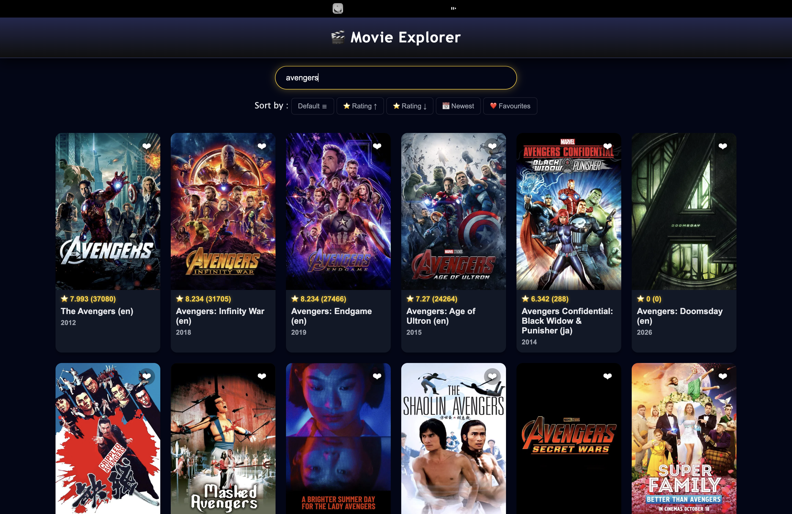
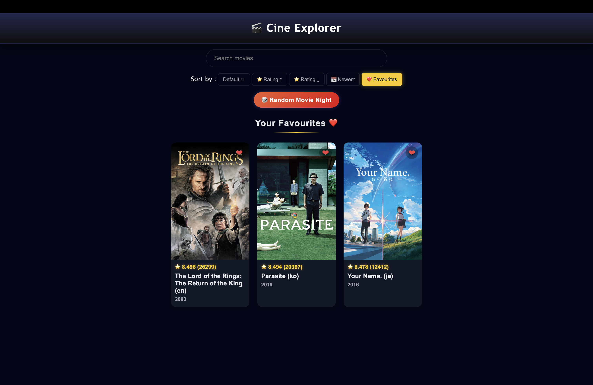

# 🎬 MovieDB Explorer

A modern movie browsing web application built using the TMDb API.
Users can explore top-rated movies, search any movie in real time, sort results, and save their favourites — all in a sleek dark-themed interface inspired by streaming platforms.

---

## 🚀 Features

* 🎥 View top-rated movies (default homepage)
* 🔍 Search any movie using TMDb API
* ⭐ Sort movies by rating (high → low / low → high)
* 📅 Sort movies by latest release year
* ❤️ Add and remove favourites
* 💾 Favourites stored using LocalStorage
* 🎯 Clean UI with dark theme
* 📱 Responsive design (mobile friendly)

---

## 🛠 Technologies Used

* HTML
* CSS
* JavaScript (Vanilla JS)
* TMDb API
* Fetch API

---

## 📡 API Used

**TMDb (The Movie Database) API**
Used to fetch movie data including titles, posters, ratings, and release dates.

---

## ⚙️ How to Run

1. Clone the repository

   git clone https://github.com/your-username/movie-explorer.git

2. Navigate to the project folder

   cd movie-explorer

3. Open the project
   Open `index.html` in your browser

---

## 🌐 Live Demo

[Movie Explorer](https://popular-movies-pi.vercel.app/)

---

## 📸 Preview

### 🏠 Home Page

### 🔍 Search Results

### ❤️ Favourites

---

## 📌 Key Learnings

* Working with real-world APIs
* Handling asynchronous JavaScript (fetch, async/await)
* Managing application state (search, sorting, favourites)
* Using LocalStorage for data persistence
* Handling missing or inconsistent API data
* Building responsive UI layouts

---

## 🔮 Future Improvements

* 🎭 Filter by genres
* 🎬 Movie details page / modal
* 🔄 Pagination or infinite scroll
* 🎲 Random movie suggestion

---

## 👨‍💻 Author

**Ipsit Debnath**
